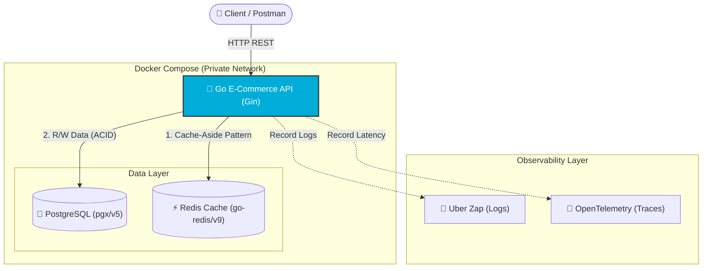

# Go E-Commerce Backend (Industrial Architecture)

Proyek ini adalah implementasi Backend menggunakan bahasa Go dengan standar **Clean Architecture** dan **Production-Ready Engineering**.

## 🚀 Tech Stack

- **Language:** Go (Golang)
- **Framework:** Gin Gonic
- **Database:** PostgreSQL (pgx/v5 with Connection Pooling)
- **Caching:** Redis (go-redis/v9)
- **Configuration:** Viper (Environment Management)
- **Security:** JWT (JSON Web Tokens) & golang.org/x/crypto/bcrypt
- **Observability & Resilience:** - Uber Zap (Structured Logging)
  - OpenTelemetry (Distributed Tracing)
  - golang.org/x/time/rate (Rate Limiting)
- **Testing:** testify (Assertions), testcontainers-go (Docker-based Integration Testing)
- **Migration:** golang-migrate
- **Currency Handling:** shopspring/decimal
- **API Documentation:** Swagger (swaggo/swag)

## 🛠️ Arsitektur

Mengikuti prinsip Clean Architecture:



- `internal/domain`: Kontrak interface dan entitas pusat.
- `internal/repository`: Implementasi SQL murni & akses database.
- `internal/usecase`: Logika bisnis utama & Caching Strategy.
- `internal/handler`: Layer API, input validation (Gin), & Response Standard.
- `internal/middleware`: Lapisan pertahanan (Auth, RBAC, Rate Limiting, Logger, OTel).

## ✨ Fitur Utama (Implemented)

- **ACID Transactions:** Menjamin integritas data saat checkout.
- **High Performance Caching:** Implementasi Cache-Aside Pattern dengan Redis untuk katalog produk.
- **Environment Management:** Konfigurasi fleksibel menggunakan Viper (.env & OS variables).
- **Clean Dependency Injection:** Kode modular dengan pemisahan interface yang ketat.
- **Security Layer:** Autentikasi berbasis JWT statless dan otorisasi dengan Role-Based Access Control (RBAC).
- **Infrastructure Protection:** Proteksi server dengan per-IP Rate Limiting, penyebaran Request ID (UUID) untuk _tracing_, dan _Structured Logging_.
- **Distributed Tracing:** Terintegrasi dengan OpenTelemetry (OTel) untuk pemantauan latensi API secara presisi.
- **Graceful Shutdown:** Memastikan server mati dengan aman tanpa memutus transaksi.
- **Automated Testing:** Pengujian logika murni (Table-Driven Tests) dan Integration Testing database tersolasi secara _on-the-fly_ menggunakan Docker & Testcontainers.

## 📈 Progres (Bulan 3 - Minggu 9)

- [x] Setup Environment & Database Connection Pooling
- [x] Database Migration System
- [x] Product Module (CRUD with Soft Delete)
- [x] Order Module (ACID Transactions - Checkout Logic)
- [x] Modular Refactoring & Viper Configuration
- [x] Caching Strategy (Redis Implementation)
- [x] Authentication & Security (JWT, Bcrypt, & Simple RBAC)
- [x] Infrastructure Middleware (Request ID, Logging, Rate Limiting)
- [x] Self-Review Final Project API E-Commerce
- [x] Unit Testing & Table-Driven Tests (Day 57-58)
- [x] Integration Testing dengan testcontainers-go (Day 59-60)
- [x] Structured Logging dengan Uber Zap (Day 61)
- [x] OpenTelemetry (OTel) Minimal Instrumentation (Day 61)
- [x] Profiling Performa (pprof) (Day 62)
- [x] Dockerisasi Aplikasi (Dockerfile & Multi-stage Build) _(Day 29-30)_
- [x] Docker Compose (Orkestrasi Multi-Container)
- [x] CI/CD Pipeline (GitHub Actions untuk Automated Testing)
- [x] Implement gRPC endpoint for product service

## ⚙️ Cara Menjalankan

### 1. Menyiapkan Proyek

1. Clone repository.
2. Buat file `.env` dari contoh di bawah. Perhatikan bahwa konfigurasi host database dan cache telah diatur agar sesuai dengan arsitektur jaringan internal Docker Compose:

```env
DB_URI=postgresql://user:password@db:5432/toko_db?sslmode=disable
PORT=8080
REDIS_URL=cache_server:6379
JWT_SECRET=your_secret_key
```

### 2. Menjalankan via Docker Compose (Production-Ready)

Aplikasi ini beserta infrastrukturnya (PostgreSQL & Redis) sudah diorkestrasi menggunakan Docker Compose. Sistem ini otomatis menciptakan jaringan tertutup (Private Network) dan volume persisten untuk keamanan data.

**Menyalakan Seluruh Sistem (API, DB, Cache):**

```bash
docker compose up -d --build
```

**Cek Logs API Real-time:**

```bash
docker compose logs -f api
```

**Melihat Status Kontainer:**

```bash
docker compose ps
```

**Akses API:**

- Swagger Docs: `http://localhost:8080/swagger/index.html`
- Health check: `http://localhost:8080/ping`

**Mematikan Sistem:**

```bash
docker compose down
```

_(Catatan: Data PostgreSQL aman dan tidak akan hilang karena menggunakan Docker Volumes `pgdata`)._

### 3. Analisis Performa (Profiling dengan pprof)

Aplikasi ini sudah dilengkapi dengan sensor `pprof` untuk membedah performa CPU dan memori secara _real-time_.

1. Pastikan server sedang berjalan dan sedang menerima trafik (bisa gunakan Postman atau alat Load Test seperti `hey`).
2. Buka terminal baru dan jalankan salah satu perintah berikut:

**Melihat Profil CPU (Selama 10 detik):**

```bash
go tool pprof -http=:8081 "http://localhost:8080/debug/pprof/profile?seconds=10"
```

**Melihat Profil Memori (Heap/RAM):**

```bash
go tool pprof -http=:8081 "http://localhost:8080/debug/pprof/heap"
```

_(Catatan: Anda membutuhkan Graphviz yang terinstal di OS Anda untuk melihat visualisasi Flame Graph di browser)._

## 📡 gRPC Service

Layanan ini juga mendukung komunikasi gRPC untuk performa tinggi antar-layanan (Microservices).

- **Port:** `50051`
- **Service Definition:** `proto/product.proto`

**Cara Testing gRPC di Postman:**

1. Gunakan opsi "New" -> "gRPC Request".
2. Masukkan URL: `grpc://localhost:50051`
3. Pada tab "Service definition", import file `proto/product.proto`.
4. Pilih metode `ProductService / GetProductByID` dan masukkan JSON payload:
   ```json
   {
     "id": 1
   }
   ```
